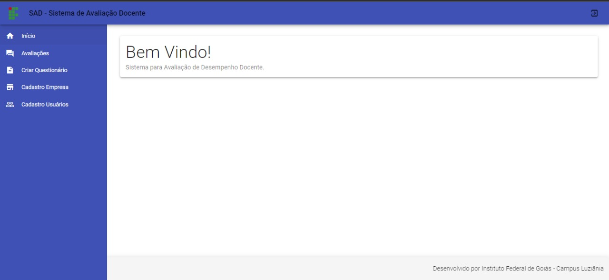

# SAD-avaliacao_desempenho_docente
TCC -  (SAD  - Sistema de Aavaliação Desempenho Docente do Instituto Federal de Goiás)

  Conforme relatado neste trabalho procura-se construir um sistema que contemple as recomendações da instituição, desde as ferramentas já utilizadas, passando pela      escolha das tecnologias de desenvolvimento, a preparação do sistema e a adequada da utilização dos resultados, até os métodos de implantação a ações de manutenção.

  Este projeto de pesquisa tem como objetivo apresentar a necessidade de um SAD para o apoio das demandas de avaliação de desempenho docente da Comissão Permanente de Pessoal Docente (CPPD) e entregar uma melhoria importante para a organização, podendo assim facilitar o processo de progressão dos docentes da instituição.

    Tela de Login  
     
    Home  
     
    Tela de Avaliação Docente  
     

